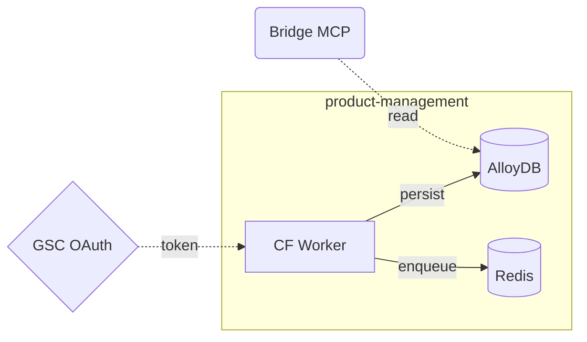

# Visualize Architecture

Data-engineering skill. Backed by `scripts/lib/visualize-architecture.ts` (pure functions, 12 unit tests).

Given a declarative `ArchSpec` (JSON), generates a Mermaid `graph LR` diagram with subgraphs per vertical + a component table.

## Workflow

1. **Draft the arch spec.** Describe nodes (components) and edges (data flows):

   ```json
   {
     "title": "Product-Management Coworker",
     "outcomeId": "ODEP8",
     "nodes": [
       { "id": "W",   "label": "CF Worker",   "type": "worker",   "group": "product-management" },
       { "id": "DB",  "label": "AlloyDB",     "type": "alloydb",  "group": "product-management" },
       { "id": "R",   "label": "Redis",       "type": "redis",    "group": "product-management" },
       { "id": "MCP", "label": "Bridge MCP",  "type": "mcp" },
       { "id": "EXT", "label": "GSC OAuth",   "type": "external" }
     ],
     "edges": [
       { "from": "W",   "to": "DB",  "label": "persist" },
       { "from": "W",   "to": "R",   "label": "enqueue" },
       { "from": "MCP", "to": "DB",  "label": "read",  "style": "dashed" },
       { "from": "EXT", "to": "W",   "label": "token", "style": "dashed" }
     ]
   }
   ```

   Node types: `worker | alloydb | redis | mcp | connector | skill | client | external`.
   Edge styles: `solid` (default) | `dashed`.

2. **Generate the diagram:**

   ```bash
   tsx scripts/visualize-architecture.ts --spec=arch.json
   ```

3. **Review the output** — paste the `\`\`\`mermaid` block into an ADR or PR description for reviewers.

## Output



## Node shape mapping

| Type | Mermaid shape |
|---|---|
| worker | `[label]` |
| alloydb / redis | `[(label)]` |
| mcp | `(label)` |
| skill | `[[label]]` |
| external | `{label}` |
| client | `([label])` |

## Connectors

None required — pure local generation from the spec JSON.

## See also

- `../../coworker-context.md` — chassis grounding
- `scripts/lib/visualize-architecture.ts` — pure-function implementation
- `scripts/lib/visualize-architecture.test.ts` — 12 unit tests
- `skills/trace-data-flow/SKILL.md` — feeds hop data into the arch spec
- `docs/architecture.md` — human-authored topology reference
